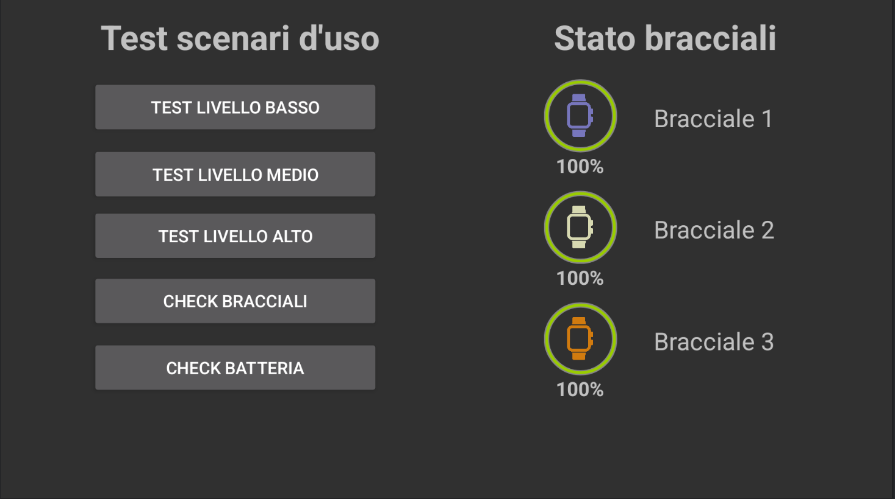

# Safety Shield - Android App

This application serves as a user interface for visualizing and managing the state of three intelligent bracelets, including their battery levels and availability. Additionally, the app allows for the simulation of various system scenarios.

## Features

- **Real-time Visualization**: Monitor the current state of the intelligent bracelets, including battery status and availability.
- **Simulation**: Simulate different system scenarios to test and visualize how the system behaves under various conditions.
- **User-friendly Interface**: Easy-to-use interface designed for intuitive interaction with the CPS.

## Screenshots




## Getting Started

### Prerequisites

- Android Studio 4.0 or later
- Android device or emulator running Android 5.0 (Lollipop) or later
- OTG cable to communicate with the Master device through Serial Port at 19600 Baudrate
- Arduino device of your choice as Master device

### Installation

1. **Clone the repository**:
   ```bash
   git clone https://github.com/Ftavaglione/Safety_Shield.git
   cd Safety_Shield
   ```

2. **Open the project in Android Studio**:
    - Launch Android Studio.
    - Click on `File > Open` and navigate to the directory where you cloned the repository.
    - Select the project to open it.

3. **Build and run the app**:
    - Connect your Android device or start an emulator.
    - Click on `Run > Run 'app'` or press `Shift + F10`.

## Usage

### Visualizing Bracelet States

- Open the app on your Android device.
- The main screen will display the current state of the three intelligent bracelets, showing their battery levels and availability status.

### Simulating Scenarios

- Navigate to the simulation section using the bottom navigation bar.
- Select a scenario to simulate.
- The app will update to reflect the new simulated state, allowing you to observe and analyze the system's behavior.